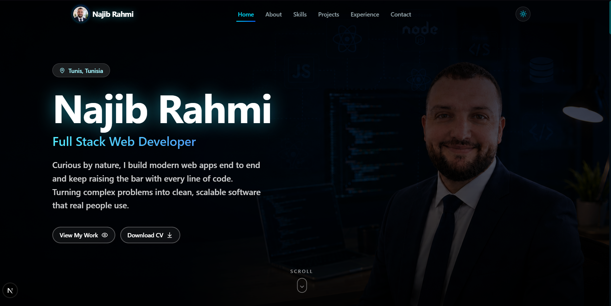
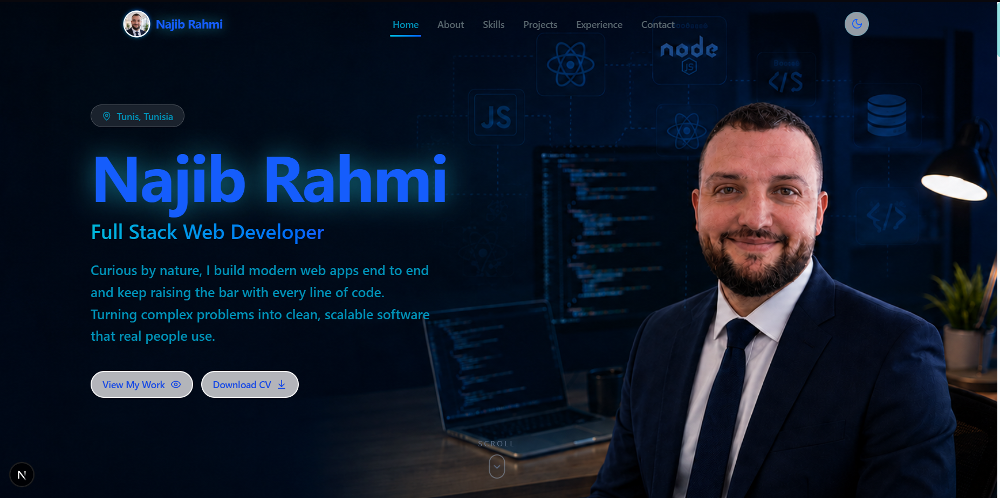
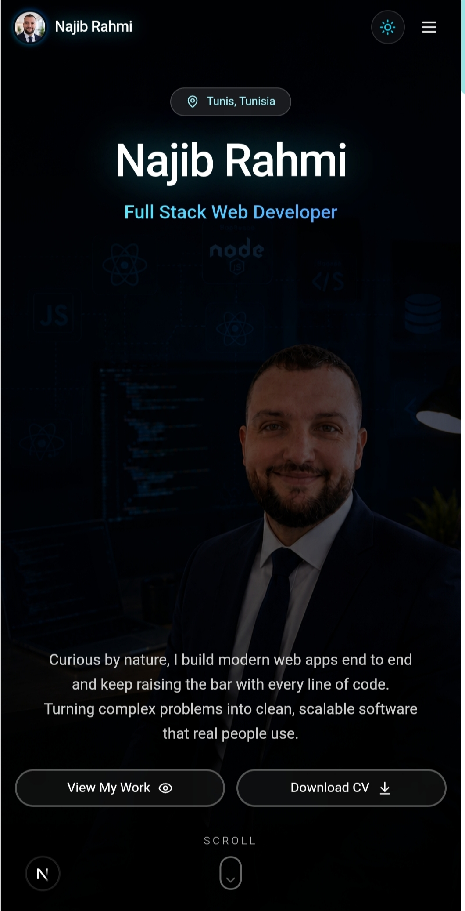

# Najib Rahmi — Full Stack Web Developer

<div align="center">

**A portfolio that doesn't just show work. It makes you want to scroll.**

[🌐 Visit the live site](https://najibrahmi.vercel.app)

</div>

---

## First, the hero.

> You open the page and a photo fills the entire screen. A name glows in cyan. Two buttons wait. One scroll, and the story begins.

This is not a template. This is not a boilerplate. It's a portfolio built to make recruiters stop scrolling and start reading.

### Desktop — Dark Mode

<p align="center">
  
</p>

### Desktop — Light Mode

<p align="center">
  
</p>

### Mobile — Dark Mode

<p align="center">
  
</p>

### Mobile — Light Mode

<p align="center">
  
</p>

---

## What makes the hero different?

- **A real photo, not a gradient** — the background is an actual portrait, scaled to cover any screen without distortion
- **A name that glows** — "Najib Rahmi" sits in blue with a cyan halo, visible in both light and dark mode
- **A role, not a job title** — "Full Stack Web Developer" tells you what, the tagline tells you why
- **Two buttons, one decision** — "View My Work" or "Download CV". No fluff
- **A scroll cue at the bottom** — because the hero is just the beginning

On mobile, the layout shifts. Name and role move up, buttons sit side by side, the portrait background changes to a phone-optimized shot. The experience adapts. It never breaks.

---

## But the hero is only the start.

Behind that first screen, there are five more sections waiting. Each one is built to answer a question a recruiter or client would ask, in order:

1. **About** — who is this person, and do they care about their craft?
2. **Skills** — what can they actually do, and can they prove it with real tools?
3. **Projects** — have they shipped anything real?
4. **Experience** — where have they been, and where are they going?
5. **Contact** — can I reach them right now?

You won't see screenshots of those sections here. That would spoil it.

**[See the full portfolio →](https://najibrahmi.vercel.app)**

---

## The tech behind it

Built with a modern, lean stack. No bloat, no unused dependencies.

| Layer | Choice |
|-------|--------|
| Framework | Next.js 16 (App Router) |
| Language | TypeScript 5 |
| Styling | Tailwind CSS 4 |
| Animations | Framer Motion |
| Icons | Lucide + custom inline brand SVGs |
| Theming | next-themes (light / dark) |
| SEO | Metadata, JSON-LD, sitemap, robots |

---

## Run it locally

```bash
git clone https://github.com/Najib-Rahmi/Najib-Rahmi.github.io.git
cd Najib-Rahmi.github.io
bun install
bun run dev
```

Open `http://localhost:3000` and see it for yourself.

---

## Customize it

All content lives in one file: [`src/lib/portfolio-data.ts`](src/lib/portfolio-data.ts). Edit the profile, skills, projects, and experience there. Replace `public/cv.pdf` with your real CV. Swap the hero backgrounds in `public/hero-bg.png` (desktop) and `public/hero-bg-mobile.png` (mobile).

---

<div align="center">

**Curious yet?**

[**najibrahmi.vercel.app**](https://najibrahmi.vercel.app)

</div>

---

<sub>Built with Next.js 16, TypeScript, Tailwind CSS 4, and attention to detail.</sub>
