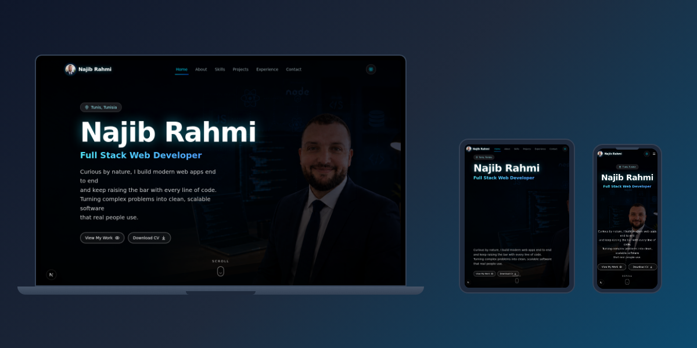
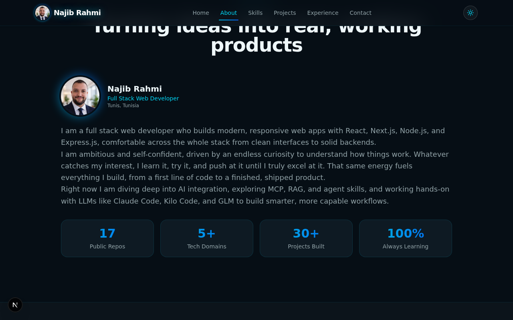
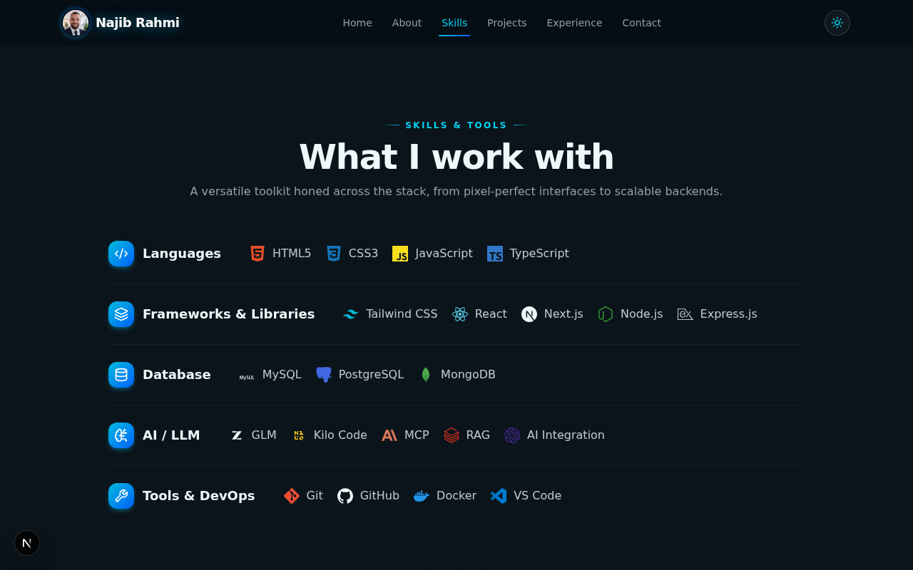
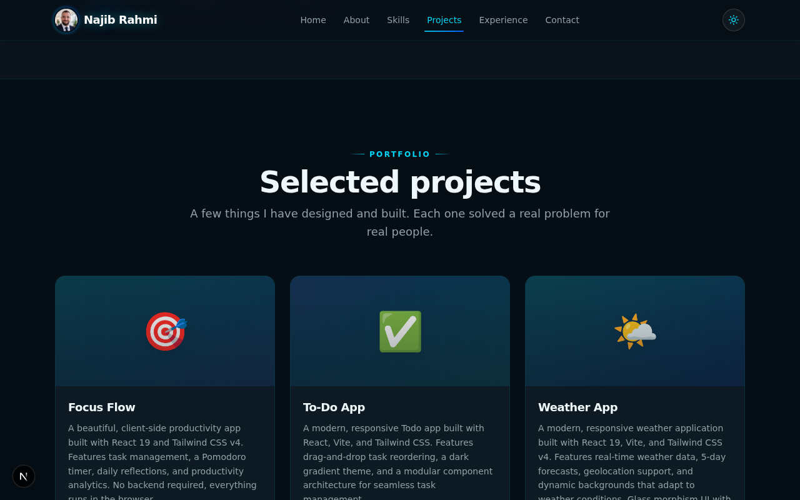
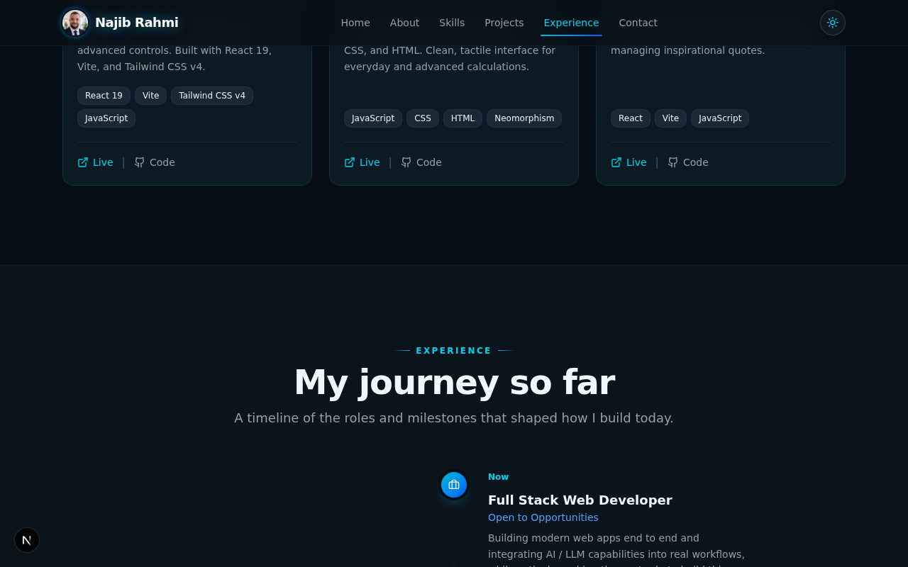
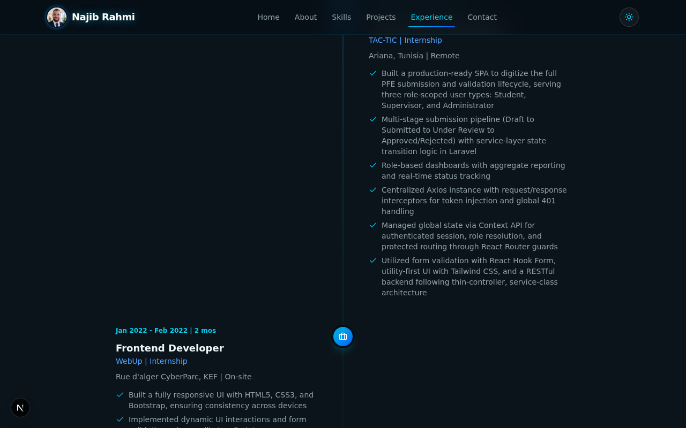
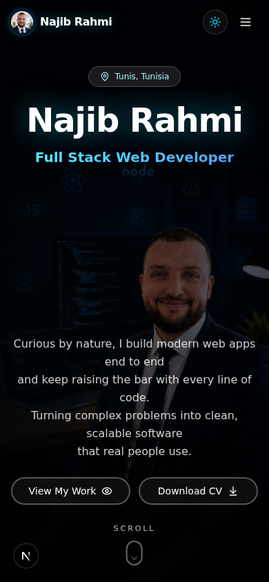
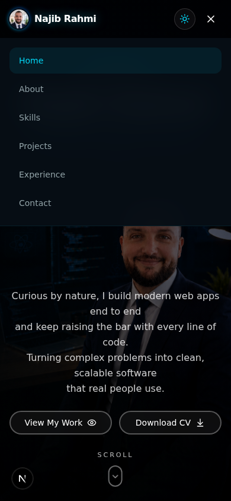

# Najib Rahmi | Full Stack Web Developer Portfolio



A modern, responsive personal portfolio website built with Next.js 16, TypeScript, and Tailwind CSS 4. Features a full-screen hero with photo background, smooth animations, light/dark mode, official brand icons, SEO optimization, and a clean cyan/blue/white color scheme.

---

## Table of Contents

- [Overview](#overview)
- [Screenshots](#screenshots)
- [Features](#features)
- [Tech Stack](#tech-stack)
- [Project Structure](#project-structure)
- [Getting Started](#getting-started)
- [Customization](#customization)
- [SEO](#seo)
- [Deployment](#deployment)
- [License](#license)

---

## Overview

This portfolio showcases the work, skills, and experience of **Najib Rahmi**, a full stack web developer based in Tunis, Tunisia. The site is a single-page application with smooth scroll navigation, a responsive design that works flawlessly across desktop, tablet, and mobile, and a professional cyan/blue/white color scheme with light and dark mode support.

### Responsive Design

<table>
  <tr>
    <td align="center"><b>Desktop (Dark)</b></td>
    <td align="center"><b>Desktop (Light)</b></td>
  </tr>
  <tr>
    <td></td>
    <td></td>
  </tr>
  <tr>
    <td align="center"><b>Mobile (Dark)</b></td>
    <td align="center"><b>Mobile (Light)</b></td>
  </tr>
  <tr>
    <td></td>
    <td></td>
  </tr>
</table>

---

## Screenshots

### Hero Section

<table>
  <tr>
    <td align="center"><b>Desktop - Dark Mode</b></td>
    <td align="center"><b>Desktop - Light Mode</b></td>
  </tr>
  <tr>
    <td></td>
    <td></td>
  </tr>
  <tr>
    <td align="center"><b>Mobile - Dark Mode</b></td>
    <td align="center"><b>Mobile - Light Mode</b></td>
  </tr>
  <tr>
    <td></td>
    <td></td>
  </tr>
</table>

Full-screen hero with photo background, name with cyan glow, role, tagline, and two CTA buttons (View My Work + Download CV). Scroll indicator at the bottom.

### About Section



Avatar with gradient glow, name, role, location, a 3-paragraph bio, and 4 stat boxes (17 Public Repos, 5+ Tech Domains, 30+ Projects Built, 100% Always Learning).

### Skills Section



Five categories (Languages, Frameworks & Libraries, Database, AI/LLM, Tools & DevOps) with official brand icons rendered as inline SVGs. No boxes, just a clean divided list layout.

### Projects Section



Six real GitHub projects displayed in a responsive grid with cover gradients, descriptions, tech tags, and live/code links.

### Experience Section



A vertical timeline with alternating left/right entries. Includes current status, documented medical recovery, and two professional internships.

### Contact Section



Location link, social media icons (GitHub, LinkedIn, WhatsApp, Email), and a validated contact form with a REST API backend.

### Mobile

| Hero | Navigation Menu |
|------|-----------------|
|  |  |

Mobile-optimized layout with portrait background photo, name/role near the top, buttons side by side, and a hamburger menu with smooth-scroll navigation.

---

## Features

### Design
- **Cyan / Blue / White color scheme** only, clean and professional
- **Light and dark mode** with a toggle button (defaults to dark)
- **Smooth scroll** navigation with active section highlighting
- **Subtle hover animations** on cards, icons, and buttons
- **Cyan glow effect** on the hero name and navbar logo
- **No em dashes** in any text content (uses commas, periods, or ` | `)

### Sections
1. **Hero** - Full-screen photo background with dark overlay, name with cyan glow, role, tagline, CTA buttons, scroll indicator
2. **About Me** - Avatar, bio (3 paragraphs), 4 stat boxes
3. **Skills** - 5 categories with official brand SVG icons (no boxes)
4. **Projects** - 6 real GitHub repos with descriptions, tags, and links
5. **Experience** - Timeline with 4 entries (current, medical recovery, 2 internships)
6. **Contact** - Location, social icons, validated contact form with REST API

### Technical
- **Fully responsive** - desktop, tablet, and mobile layouts
- **SEO optimized** - metadata, JSON-LD structured data, sitemap, robots.txt
- **Accessible** - skip-to-content link, ARIA attributes, keyboard navigation
- **Official brand icons** - inline SVGs from Simple Icons (React, Next.js, Node.js, etc.)
- **REST API** - contact form validation with server-side checks
- **Security headers** - nosniff, X-Frame-Options, Referrer-Policy, Permissions-Policy

---

## Tech Stack

| Category | Technology |
|----------|-----------|
| **Framework** | Next.js 16 (App Router) |
| **Language** | TypeScript 5 |
| **Styling** | Tailwind CSS 4 (CSS-based `@theme` config) |
| **UI Components** | shadcn/ui (button, input, textarea, toast only) |
| **Icons** | Lucide React + custom inline SVGs (Simple Icons) |
| **Animations** | Framer Motion |
| **Theming** | next-themes (light/dark mode) |
| **Fonts** | Geist Sans + Geist Mono (Google Fonts) |

---

## Project Structure

```
my-project/
├── public/
│   ├── avatar.png              # GitHub avatar
│   ├── hero-bg.png             # Desktop hero background (landscape)
│   ├── hero-bg-mobile.png      # Mobile hero background (portrait)
│   ├── cv.pdf                  # CV download (placeholder)
│   └── screenshots/            # README screenshots
├── src/
│   ├── app/
│   │   ├── layout.tsx          # Root layout + metadata + JSON-LD
│   │   ├── page.tsx            # Main page (assembles all sections)
│   │   ├── globals.css         # Tailwind v4 theme + custom styles
│   │   ├── robots.ts           # Dynamic robots.txt
│   │   ├── sitemap.ts          # Dynamic sitemap.xml
│   │   └── api/
│   │       └── contact/
│   │           └── route.ts    # Contact form REST API
│   ├── components/
│   │   ├── navbar.tsx          # Fixed navbar with mobile menu
│   │   ├── footer.tsx          # Sticky footer
│   │   ├── theme-provider.tsx  # next-themes wrapper
│   │   ├── theme-toggle.tsx    # Light/dark toggle button
│   │   ├── section-heading.tsx # Reusable section heading
│   │   ├── tech-icon.tsx       # Official brand SVG icons
│   │   ├── ui/                 # shadcn/ui (5 components only)
│   │   └── sections/
│   │       ├── hero.tsx
│   │       ├── about.tsx
│   │       ├── skills.tsx
│   │       ├── projects.tsx
│   │       ├── experience.tsx
│   │       └── contact.tsx
│   ├── lib/
│   │   ├── portfolio-data.ts   # All content (profile, skills, projects, etc.)
│   │   ├── db.ts               # Prisma client
│   │   └── utils.ts            # cn() helper
│   └── hooks/
│       ├── use-toast.ts
│       └── use-mobile.ts
├── next.config.ts              # Next.js config + security headers
├── package.json
└── README.md
```

---

## Getting Started

### Prerequisites

- [Node.js](https://nodejs.org/) 18+ 
- [Bun](https://bun.sh/) (recommended) or npm/yarn

### Installation

```bash
# Clone the repository
git clone https://github.com/Najib-Rahmi/Najib-Rahmi.github.io.git
cd Najib-Rahmi.github.io

# Install dependencies
bun install

# Start the dev server
bun run dev
```

The site will be available at `http://localhost:3000`.

### Available Scripts

| Script | Description |
|--------|-------------|
| `bun run dev` | Start the dev server on port 3000 |
| `bun run lint` | Run ESLint to check code quality |
| `bun run build` | Build for production |
| `bun run start` | Start the production server |

---

## Customization

All content lives in **`src/lib/portfolio-data.ts`**. Edit this single file to update:

### Profile

```ts
export const profile = {
  name: "Najib Rahmi",
  role: "Full Stack Web Developer",
  tagline: "Your tagline here...",
  bio: "Your bio here...",
  location: "Tunis, Tunisia",
  email: "najib.rahmi.dev@gmail.com",
  avatar: "/avatar.png",
  githubUrl: "https://github.com/Najib-Rahmi",
};
```

### Skills

Each category has a `title`, `icon`, and array of `skills` (each with a `name`, `icon` slug, and brand `color`):

```ts
{
  title: "Languages",
  icon: Code2,
  skills: [
    { name: "HTML5", icon: "html5", color: "#E34F26" },
    // ...
  ],
}
```

### Projects

```ts
{
  title: "Focus Flow",
  description: "Project description...",
  tags: ["React 19", "Tailwind CSS v4"],
  liveUrl: "#",
  repoUrl: "https://github.com/Najib-Rahmi/FocusFlow",
  accent: "from-cyan-500/20 to-blue-500/20",
  emoji: "🎯",
}
```

### Experience

```ts
{
  role: "Full Stack Web Developer",
  company: "TAC-TIC | Internship",
  period: "Feb 2023 - Jun 2023 | 5 mos",
  description: "Ariana, Tunisia | Remote",
  icon: Briefcase,
  highlights: ["Highlight 1", "Highlight 2"],
}
```

### Replace the CV

Replace `public/cv.pdf` with your real CV PDF file (keep the same filename).

### Replace the Hero Background

- `public/hero-bg.png` - Desktop background (landscape, 1672x941)
- `public/hero-bg-mobile.png` - Mobile background (portrait, 853x1844)

---

## SEO

This portfolio includes full SEO optimization:

- **Metadata** - Complete title, description, keywords, Open Graph, Twitter cards
- **JSON-LD** - Person, WebSite, and ProfilePage structured data for rich search results
- **Sitemap** - Auto-generated at `/sitemap.xml`
- **Robots** - Dynamic `/robots.txt` with sitemap directive
- **Canonical URL** - Set via `metadataBase` and `alternates.canonical`
- **Security Headers** - nosniff, X-Frame-Options, Referrer-Policy, Permissions-Policy

### Update the domain

When you deploy to a custom domain, update `siteUrl` in these 3 files:

1. `src/app/layout.tsx` (metadataBase, Open Graph, JSON-LD)
2. `src/app/sitemap.ts`
3. `src/app/robots.ts`

---

## Deployment

### Vercel (Recommended)

1. Push your code to GitHub
2. Go to [vercel.com](https://vercel.com) and sign in with GitHub
3. Click "Add New Project" and import your repository
4. Vercel auto-detects Next.js, just click "Deploy"
5. Your site will be live at `your-project.vercel.app`

### Custom Domain

1. Buy a domain (e.g. `najibrahmi.com`) from Namecheap, Cloudflare, or Porkbun
2. In Vercel, go to Settings > Domains and add your domain
3. Configure DNS records at your registrar (CNAME for www, A record for apex)
4. Vercel provisions free SSL automatically
5. Update `siteUrl` in the 3 files mentioned above

### GitHub Pages

This project is configured for Vercel, but can be adapted for GitHub Pages with `next export`.

---

## License

This project is open source and available under the [MIT License](LICENSE).

---

## Author

**Najib Rahmi**
- GitHub: [github.com/Najib-Rahmi](https://github.com/Najib-Rahmi)
- LinkedIn: [linkedin.com/in/rehminajib](https://www.linkedin.com/in/rehminajib)
- Email: najib.rahmi.dev@gmail.com

---

*Built with Next.js 16, TypeScript, Tailwind CSS 4, and care.*
